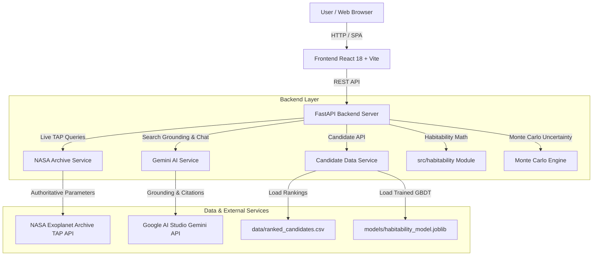

# 🪐 Advanced Exoplanet Habitability Ranking & Exploration System

An interactive full-stack web application for browsing ranked exoplanet candidates, looking up live authoritative parameters from the NASA Exoplanet Archive, querying descriptive context via Gemini Search Grounding, chatting with a tool-using AI assistant, and running custom habitability detections with Monte Carlo Gaussian uncertainty simulations.

> [!IMPORTANT]
> **Scientific Framing & Constraints**
> - **ExoMiner Scope**: NASA ExoMiner and ExoMiner++ classify transit signals (determining the probability of a real planet vs a false positive). ExoMiner does **NOT** measure or classify habitability.
> - **Potential Habitability**: All outputs are computed *potential habitability estimates* with uncertainty based on physical parameters (insolation, radius, temperature). They are **never** confirmation of habitability, liquid water, or life.

---

## 🏗️ Technical Architecture



---

## 🛠️ Stack Overview

- **Backend**: Python 3.11+, FastAPI, Pydantic v2, `google-genai` SDK, `httpx`, `pandas`, `scikit-learn`, `joblib`.
- **Frontend**: React 18 + Vite + TypeScript + Tailwind CSS + Plotly.js.
- **Data Provenance**: NASA Exoplanet Archive TAP Service + ExoMiner++ TESS Vetting Catalog on Zenodo (DOI: 10.5281/zenodo.15466292).

---

## 🚀 Quick Start Guide

### 1. Environment Configuration
Copy `.env.example` to `.env` and configure your Google AI Studio API key:

```bash
cp .env.example .env
```

Edit `.env`:
```env
GOOGLE_API_KEY=your_google_ai_studio_api_key_here
GEMINI_MODEL=gemini-3.8-flash
PORT=8000
HOST=0.0.0.0
```

### 2. Single-Command Launch

Launch the unified FastAPI server & single-page application:

```bash
python3 -m uvicorn backend.app.main:app --host 0.0.0.0 --port 8000
```

Open your web browser to **[http://localhost:8000](http://localhost:8000)**.

---

## 🔄 How to Refresh Data & Models

To re-ingest fresh NASA Exoplanet Archive records, update feature engineering, and retrain habitability models:

```bash
python3 exoplanet_pipeline.py
```

This updates `data/ranked_candidates.csv` and `models/habitability_model.joblib`.

---

## 🧪 Running Unit Tests & Benchmarks

Run the pytest unit test suite (10 test cases):

```bash
python3 -m pytest tests/
```

Run the 15-question Chatbot Safety & Grounding Benchmark:

```bash
PYTHONPATH=. python3 tests/run_evaluation.py
```

Check `docs/EVALUATION_REPORT.md` for itemized evaluation metrics.

---

## 🙏 Acknowledgements & Citations

1. **NASA Exoplanet Archive**: Sourced via TAP service (`pscomppars` table). Operates under contract with NASA under the Exoplanet Exploration Program.
2. **ExoMiner & ExoMiner++**: Developed by Hamann et al. / NASA Ames Research Center. Zenodo DOI: 10.5281/zenodo.15466292.
3. **Kopparapu et al. (2013/2014)**: *Habitable Zones Around Main-Sequence Stars: New Estimates*. The Astrophysical Journal, 765(2), 131.
4. **Google AI Studio**: Gemini API Terms & Search Grounding rules.

---

## 🔮 Limitations & Next Steps

1. **API Quota Constraints**: Free-tier Google AI Studio API key rate limits may fall back to local database lookups during traffic bursts.
2. **Simplified Albedo Assumption**: Uses standard Bond albedo $A = 0.3$; atmospheric composition and greenhouse dynamics require spectroscopic observations (e.g., JWST).

### 3 Next Steps
- [ ] Integrate JWST transmission spectroscopy data tables for atmospheric composition analysis.
- [ ] Add 3D interactive Orbit Visualizers for multi-planet systems (e.g., TOI-700, TRAPPIST-1).
- [ ] Implement user bookmarking & exportable PDF scientific reports.
