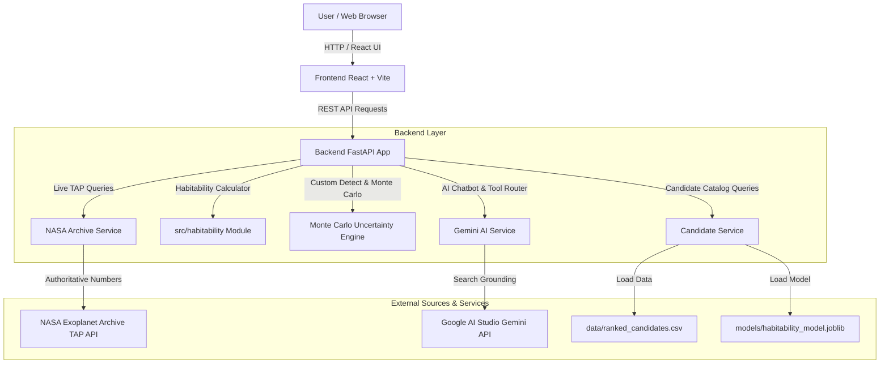

# Technical Architecture — Exoplanet Habitability Web Application

Overview of the system topology, data flow, dual-source resolution, and machine learning pipeline.

## System Components

1. **Frontend (React + TypeScript + Tailwind CSS)**:
   - 5 Views: Ranked Candidates, Planet Details, AI Chatbot, Custom Detector, About & Methods.
   - Persistent banner enforcing ExoMiner scientific framing.
2. **FastAPI Backend (`backend/app/main.py`)**:
   - High-performance async REST server with type validation via Pydantic.
   - Static asset serving for compiled single-page application.
3. **Data Layer & ML Classifier**:
   - Multi-stage rankings combining ExoMiner probability scores with Kopparapu Habitable Zone boundary models and scikit-learn GBDT classifiers.
4. **Dual-Source Resolution**:
   - NASA Archive TAP Service is the single authoritative source of truth for numeric values.
   - Gemini Search Grounding provides qualitative context and citations.
